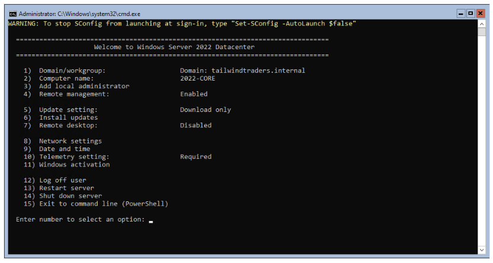

# Azure Stack HCI Single Server Deployment

At Microsoft Build 2022, the Azure Stack HCI Single Node was announced on 5/24/2022. 

Unfortunately the Stack cannot be installed via the Windows Admin Center (at this time), so the installation has to be done via Powershell.

In this repository I provide the corresponding Powershell scripts for the deployment.

Reference information: 
```
https://techcommunity.microsoft.com/t5/azure-stack-blog/announcing-azure-stack-hci-support-for-single-node-clusters/ba-p/3408431
https://docs.microsoft.com/de-de/azure-stack/hci/concepts/single-server-clusters 
https://docs.microsoft.com/de-de/azure-stack/hci/deploy/single-server 
https://docs.microsoft.com/en-us/azure-stack/hci/deploy/create-cluster-powershell
```


## Step 1 - Download and install Azure Stack HCI ISO Image
Before we can use Azure Stakc HCI we have to download it from the MIcrosoft Website. See here: https://azure.microsoft.com/de-de/products/azure-stack/hci/hci-download/.
Then you install the Image to your Hardware.

## Step 2 - Configure the server (with SConfig)
In this step you configure the core information of the node.

|Step|Screenshot|
|-|-|
| SConfig Overview |  |
| Go through the steps | fill out, what you want |
| Disable SConfig from starting automatically | Set-SConfig -AutoLaunch $False |
| Reboot the node | click check ;-) |

## Step 3 - Create cluster

## Step 4 - Register the cluster

## Step 5 - Create volumes

**Ready - your are done!**
